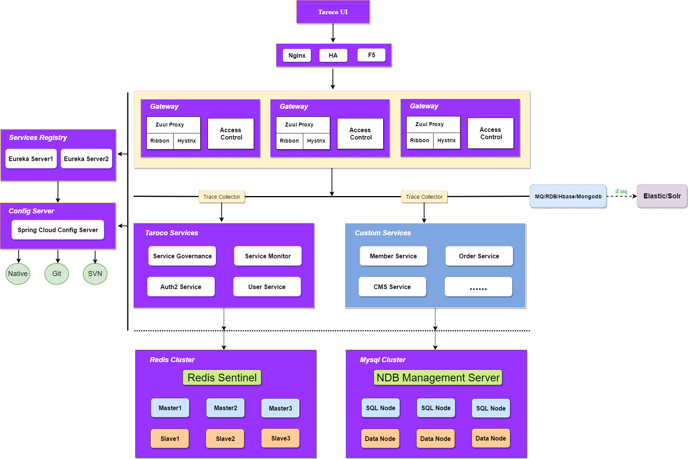

# Taroco [演示地址](http://111.231.192.110:8080)

## 前言

'Taroco'是一套完整的微服务企业级解决方案。是微服务敏捷开发的代表。我们致力于打造一套完整的微服务生态架构，包括**前端模板（react）**-**请求加密、解密**-**基础服务**-**服务治理**-**服务监控**-**持续集成**-**自动化部署**-**动态扩容**等等。我们的目标是：不加班，回家吃晚饭。

## 项目介绍

[Spring Cloud](https://projects.spring.io/spring-cloud/)是一个微服务框架，相比Dubbo等RPC框架, Spring Cloud提供更全面的分布式系统解决方案。Spring Cloud对微服务基础框架Netflix的多个开源组件进行了封装，同时又实现了和云端平台以及和Spring Boot开发框架的集成。Spring Cloud为微服务架构开发涉及的配置管理，服务治理，熔断机制，智能路由，微代理，控制总线，一次性token，全局一致性锁，leader选举，分布式session，集群状态管理等操作提供了一种简单的开发方式。

Spring Cloud本身已经封装得足够简单，也够丰富。也许正是因为这种简单而丰富，使得想要使用它的团队望而却步。学习成本太高，历史包袱太重，维护成本太高等等一系列原因。

*Taroco*就是为了解决这一问题而诞生的。*Taroco*整合了Spring Cloud的**配置中心**、**注册中心**、**服务网关**，提供了一系列starter组件，
同时提供**服务治理**、**服务监控**、**auth2权限认证**，支持**服务降级/熔断**、**基于标签(x-label)的路由**、**服务权重**，前端采用**vue+elementUI+webpack**，可以很好的解决转向Spring Cloud的一系列问题，努力为中小型企业打造全方位微服务企业级敏捷开发解决方案。

### 开发环境

* JDK1.8+
* Spring Boot 1.5.8
* Spring Cloud Dalston.SR4
* Maven 3.0+
* Redis
* MySQL 5.7
* Node.js 
* Npm

### 架构图

### 启动顺序（后台）
1. taroco-config 配置中心
> 所有服务都依赖与配置中心。
2. taroco-registry 服务注册中心
> 除配置中心外,所有服务都依赖于注册中心。
4. taroco-gateway 服务网关
> 所有请求都通过服务网关进来。网关的路由配置中配置中心的taroco-gateway-dev.yml当中。
4. taroco 基础服务
    - 4.1 taroco-admin 服务治理 
    - 4.2 taroco-monitor 服务监控
5. 其他服务

### 链接推荐

- Spring Boot 1.5.8.RELEASE官方文档 [https://docs.spring.io/spring-boot/docs/1.5.8.RELEASE/reference/htmlsingle/](https://docs.spring.io/spring-boot/docs/1.5.8.RELEASE/reference/htmlsingle/ "Spring Boot")
- Spring Cloud Dalston.SR4官方文档 [http://cloud.spring.io/spring-cloud-static/Dalston.SR4/multi/multi_spring-cloud.html](http://cloud.spring.io/spring-cloud-static/Dalston.SR4/multi/multi_spring-cloud.html "Spring Cloud")
- ANT DESIGN [https://ant.design/docs/react/getting-started-cn](https://ant.design/docs/react/getting-started-cn "ANT DESIGN")

### 资源下载

- JDK8 [http://www.oracle.com/technetwork/java/javase/downloads/jdk8-downloads-2133151.html](http://www.oracle.com/technetwork/java/javase/downloads/jdk8-downloads-2133151.html "JDK8")
- Maven [http://maven.apache.org/download.cgi](http://maven.apache.org/download.cgi "Maven")
- Redis [https://redis.io/download](https://redis.io/download "Redis")
- ActiveMQ [http://activemq.apache.org/download-archives.html](http://activemq.apache.org/download-archives.html "ActiveMQ")
- ZooKeeper [http://www.apache.org/dyn/closer.cgi/zookeeper/](http://www.apache.org/dyn/closer.cgi/zookeeper/ "ZooKeeper")
- Elastic Stack [https://www.elastic.co/downloads](https://www.elastic.co/downloads "Elastic Stack")
- Nginx [http://nginx.org/en/download.html](http://nginx.org/en/download.html "Nginx")
- Jenkins [http://updates.jenkins-ci.org/download/war/](http://updates.jenkins-ci.org/download/war/ "Jenkins")

## LICENSE

[MIT](LICENSE "MIT")